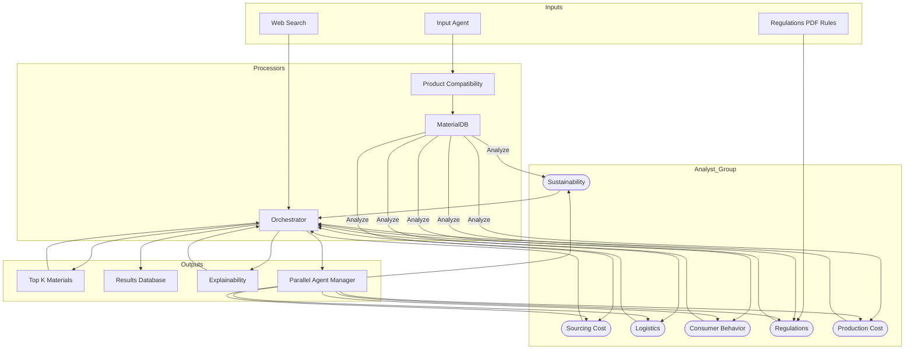

# Blue Yonder Sustainable Packaging Challenge 🌱📦


## 🏗️ Architecture



## 📋 Table of Contents
- [Overview](#-overview)
- [Features](#-features)
- [Components](#-components)
- [Installation](#-installation)
- [Usage](#-usage)
- [Output](#-output)
- [Contributing](#-contributing)
- [License](#-license)
- [Acknowledgments](#-acknowledgments)

## 🎯 Overview

A sophisticated multi-agent system for evaluating and selecting sustainable packaging materials. Built for the Blue Yonder Sustainable Packaging Challenge, this system leverages LangGraph orchestration to analyze materials across multiple dimensions:

- 🌿 **Environmental Impact**: Sustainability metrics and ecological footprint
- 💰 **Cost Analysis**: Both sourcing and production costs
- 📦 **Logistics**: Transportation and storage optimization
- 👥 **Consumer Behavior**: Market acceptance and user preferences
- ⚖️ **Regulatory Compliance**: Standards and regulations adherence

## ✨ Features

- **Intelligent Analysis**: Multi-dimensional evaluation of packaging materials
- **Parallel Processing**: Concurrent analysis through multiple specialized agents
- **LangGraph Integration**: Robust orchestration and state management
- **Interactive CLI**: User-friendly input interface
- **Comprehensive Reporting**: Detailed analysis outputs and recommendations

## 🛠️ Components

### 1. Input Layer
- `input.py`: Main entry point for product specifications
  - Interactive CLI interface
  - Input validation and normalization
  - Data preprocessing

### 2. Processing Layer
- `Product_compatibility.py`: Product-material compatibility analysis
  - Material-product fit evaluation
  - Compatibility scoring
  - Requirement validation

- `MaterialDB_agent.py`: Material database operations and queries
  - Material property lookup
  - Database management
  - Query optimization

### 3. Analysis Layer
- `Sustainability_Analyst.py`: Environmental impact assessment
  - Carbon footprint calculation
  - Recyclability analysis
  - Environmental compliance checking

- `logistics_Analyst.py`: Transportation and storage optimization
  - Shipping efficiency analysis
  - Storage requirements
  - Cost optimization

- `Consumer_Behaviour_Analyst.py`: Market acceptance analysis
  - Consumer preference modeling
  - Market trend analysis
  - Acceptance prediction

- `Sourcing_Cost_Analyser.py`: Cost-benefit analysis
  - Material cost evaluation
  - Supply chain analysis
  - ROI calculation

### 4. Orchestration Layer
- `Orchestrator.py`: Central coordination and workflow management
  - LangGraph state management
  - Parallel processing coordination
  - Results aggregation

 


## 📥 Installation

1. **Clone the Repository**
```bash
git clone https://github.com/codegeek03/Blue_Yonder_Sustainable_Packaging_Challenge.git
cd Blue_Yonder_Sustainable_Packaging_Challenge
