# Blue Yonder Sustainable Packaging Challenge 🌱📦


## 🏗️ Architecture

```mermaid
---
config:
  layout: dagre
---
flowchart TD

  %% Input Sources
  subgraph Inputs["📥 Inputs"]
    Z["🧠 Input Agent"]
    WikiSearch["🔍Tavily Search Tool"]
    DuckDuckGo["DuckDuckGoTools()"]
    Newspaper4kTools["Newspaper4kTools()"]
  end

  %% Analyst Group
  subgraph Analyst_Group["🧑‍🔬 Analyst Modules"]
    C(["🌱 Sustainability"])
    D(["💰 Sourcing Cost"])
    E(["🚚 Logistics"])
    F(["🛍️ Consumer Behavior"])
    R(["⚖️ Regulations"])
    P(["🏭 Production Cost"])
  end

  %% Processing Units
  subgraph Processors["⚙️ Processors"]
    A["🧪 Product Compatibility"]
    B["📚 MaterialDB"]
    G["🧩 Orchestrator"]
  end

  %% Explainability & Reasoning
  subgraph Explainability["🧠 Explainability Agent"]
    EX["💡 Reasoning & Insights"]
  end

  %% Output Results
  subgraph Outputs["📤 Outputs"]
    H["🏆 Top K Materials"]
    subgraph Details["📄 Details"]
      Scores["📊 Scores"]
      Tradeoffs["⚖️ Tradeoffs"]
      RegNotes["📘 Regulations Summary"]
    end
    ResultsDB["🗂️ Results Database"]
  end

  %% Data Flow
  Z --> A
  A --> B
  WikiSearch --> R
  B -- Analyze --> C & D & E & F & R & P
  C --> G
  D --> G
  E --> G
  F --> G
  P --> G
  R --> G
  WikiSearch --> G
  DuckDuckGo --> G
  Newspaper4kTools --> G

  %% Orchestration to outputs and explainability
  G --> H
  G --> ResultsDB
  G --> EX
  

  %% Details flow
  H --> Scores & Tradeoffs & RegNotes

  %% Explainability feedback loop
  EX --> G

```



## 📋 Table of Contents
- [Overview](#-overview)
- [Key Innovations](#-key-innovations)
- [Architecture & Components](#-architecture--components)
  - [1. Input Layer](#1-input-layer)
  - [2. Processing Layer](#2-processing-layer)
  - [3. Analysis Modules](#3-analysis-modules)
  - [4. Orchestration Layer](#4-orchestration-layer)
  - [5. Reporting & Persistence](#5-reporting--persistence)
- [Installation](#installation)
- [Usage](#usage)
- [Output Structure](#output-structure)
- [Error Handling & Resilience](#error-handling--resilience)
- [Contributing](#contributing)
- [License](#license)
- [Acknowledgments](#acknowledgments)

## 🎯 Overview
This system is a **LangGraph-driven**, multi-agent orchestration for evaluating and ranking sustainable packaging materials. It integrates Google’s Gemini model for rich text reasoning, executes specialized tool calls, and produces slide-ready JSON reports—automating end-to-end material selection across:

- 🌿 **Environmental Impact**  
- 💰 **Cost Analysis**  
- 📦 **Logistics & Supply-Chain**  
- 👥 **Consumer Behavior**  
- ⚖️ **Regulatory Compliance**  

## ✨ Key Innovations
- **LangGraph State Machine**  
  Orchestrates flow using a directed graph of TypedDict states, transitions, and conditional branching.
- **Parallel Agent-Calling**  
  Launches independent analysis agents concurrently (properties, logistics, cost, sustainability, consumer).
- **Parallel Tool-Calling**  
  Uses Tavily,DuckDuckGo and Newspaper4k tools for enhanced research.
- **Gemini-Backed Prompting**  
  Uses Google Gemini (v2.0-flash) for deep reasoning, with `show_tool_calls=True` to trace tool invocations and aid debugging.
- **JSON-First Reporting**  
  Each material summary is generated as a precise JSON schema—ideal for slides, dashboards, or APIs.
- **Dynamic Weighting & Scoring**  
  The composite score calculation is guided by configurable weights, allowing users to prioritize specific goals—such as sustainability or cost-effectiveness. Normalized sub-scores and detailed breakdowns     enhance transparency and explainability.
- **Regulatory Context Fetch**  
  Live web-search integration to pull jurisdiction-specific regulation snippets for each material.
- **Robust Error Handling**  
  Full error-capture, root-cause analysis via language model, and JSON error-reports for transparent troubleshooting.
- **Persistent Reporting**  
  Automatically saves both “analysis” and “error” reports under a timestamped directory.

## 🛠️ Architecture & Components

### 1. Input Layer
- **`input.py`**  
  - Asks for product name, location, target specs via CLI  
  - Validates & normalizes raw inputs  
  - Emits initial `AnalysisState.input_data`

### 2. Processing Layer
- **`Product_compatibility.py`**  
  - Evaluates material–product fit  
  - Checks basic constraints (e.g., mechanical, thermal compatibility)  
  - Populates `compatibility_analysis`
- **`MaterialDB_agent.py`**  
  - Queries internal/external material catalogs  
  - Filters by compatibility criteria  
  - Returns candidate materials list

### 3. Analysis Modules
Each runs in **parallel** under a LangGraph “run_analyses” fork:
- **`MaterialPropertiesAgent`**  
  - Measures strength, barrier properties, thermal tolerance  
- **`LogisticCompatibilityAgent`**  
  - Computes weight, bulk, transport losses  
- **`ProductionCostAgent`**  
  - Estimates sourcing & manufacturing unit costs  
- **`EnvironmentalImpactAgent`**  
  - Calculates carbon footprint, recyclability, biodegradability  
- **`ConsumerBehaviorAgent`**  
  - Models market acceptance, packaging appeal  
- **`RegulationsAgent`**  
  - Web-searches relevant directives (EU, FDA, BIS) via `show_tool_calls`
- **`ExplainabilityAgent`**
  - Generates robust explanations with thinking tools.

Each module returns a standardized top-materials list with raw scores.

### 4. Orchestration Layer
- **`Orchestrator.py`**  
  - Gathers all individual scores  
  - Applies **configurable weights** (default in code)  
  - Selects top-K materials by composite score  
  - For each, calls `generate_executive_summary()`:
    - Crafts a detailed prompt to Gemini  
    - Embeds original metrics, normalized scores, strategic bullets  
    - Injects **regulatory snippet** pulled from live search  
    - Parses the JSON response back into Python
- **LangGraph Workflow**  
  - `process_input → analyze_product_compatibility → query_material_database`  
  - **If materials found** → fork into 5 analysis nodes → join → orchestrate  
  - **Else/Error** → error handler node

### 5. Reporting & Persistence
- **Slide-Ready JSON**  
  - Schema includes:  
    1. `executive_snapshot`  
    2. `composite_score` (raw + normalized + weighted)  
    3. `strengths` & `trade_offs`  
    4. `supply_chain_implications` & `consulting_recommendation`  
    5. `regulatory_context` snippet  
- **File Saving**  
  - Writes to `temp_KB/reports/analysis_report_<timestamp>.json`  
  - Error reports likewise saved with clear statuses

---

## 🛠️ Installation
1. Clone repo  
2. `pip install -r requirements.txt`  
3. Create `.env` with `GOOGLE_API_KEY=…`  
4. Ensure directories:  
   ```bash
   mkdir -p temp_KB/reports logs
## 🚀 Usage
```bash
python main.py
```
Follow prompts for product name & location

Watch parallel tool-calls and state transitions in logs

Find JSON report in temp_KB/reports/

## 📊 Output Structure
```jsonc
{
  "product_name": "SuperSnack Bar",
  "timestamp": "2025-05-09 21:04:45",
  "top_materials": [
    {
      "material_name": "PLA Film",
      "composite_score": { /* 0–100 */ },
      "strengths": [ /* … */ ],
      "trade_offs": [ /* … */ ],
      "supply_chain_implications": { /* … */ },
      "consulting_recommendation": { /* … */ },
      "regulatory_context": "EU Packaging Directive 94/62/EC excerpt…"
    }
    // …
  ],
  "report_path": "temp_KB/reports/analysis_report_2025-05-09_21-04-45.json"
}
```
## 🛡️ Error Handling & Resilience
-Any node failure routes to handle_error

-LLM-driven root-cause analysis explains failures

-JSON error report saved alongside standard reports

-Logs include stack traces and tool-call histories

## 🤝 Contributing
-Fork & branch

-Add tests for new agents or states

-Submit PR with clear changelog

## 📄 License
-MIT © Blue Yonder Packaging Challenge

## 🙏 Acknowledgments
-LangGraph team for orchestration framework

Google Cloud for Gemini APIs

All open-source tool developers and community contributors

## Algorithmic Flowchart
 


This expanded README surfaces your system’s novel features—**parallel agent tool-calling**, **LangGraph state orchestration**, **LLM-driven JSON prompting**, and robust **error-handling with explanatory analysis**—all in a slide- and API-friendly format. Let me know if you’d like any section refined!

